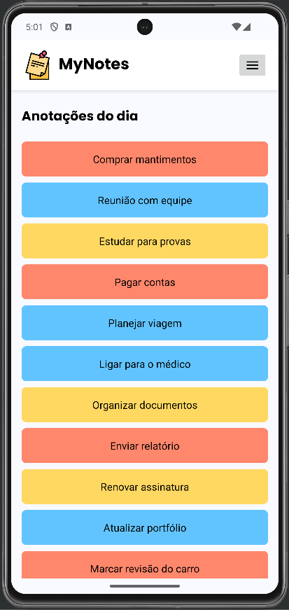

# 📝 MyNotes App

O **MyNotes App** é uma aplicação desenvolvida para gerenciar anotações de maneira fácil e organizada. Foi implementado como parte da matéria **Ferramentas Computacionais IV**.

## 📚 Funcionalidades

- **Filtrar Anotações**: Filtre suas anotações com base na prioridade (baixa, média ou alta).
- **Ordenar Anotações**: Organize suas anotações por diferentes atributos, como título ou descrição.
- **Excluir Anotações**: Exclua anotações desnecessárias com um simples clique.
- **Visualizar Detalhes**: Veja detalhes completos de cada anotação, incluindo título, descrição e prioridade.

## 💡 Objetivo

Este projeto foi desenvolvido como parte da disciplina **Ferramentas Computacionais IV**, com o intuito de aplicar os conceitos aprendidos sobre desenvolvimento de aplicativos Android.
